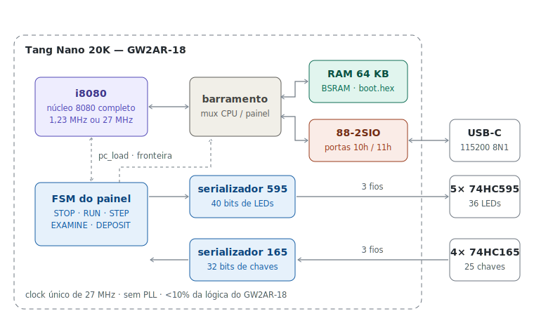

# Altair 8800 - Tang Nano 20K

Réplica funcional do **MITS Altair 8800 (1975)** em Verilog para a Sipeed
Tang Nano 20K, com núcleo Intel 8080 completo, 64 KB de RAM, console
serial 88-2SIO e **painel frontal real** (36 LEDs + 25 chaves) ligado por
apenas 6 fios, via shift registers 74HC595/74HC165.


<p align="center">
  
</p>

> Liga já rodando o **Kill the Bit** - o painel é opcional, mas é onde
> mora a diversão.

## Destaques

- **CPU i8080 completa**: todos os opcodes (documentados e não
  documentados), flags fiéis (AC, paridade, DAA correto), validada por
  autoteste em simulação.
- **64 KB de RAM** inteiros em BSRAM, conteúdo embarcado no bitstream
  (`boot.hex`).
- **88-2SIO** nas portas `10h`/`11h` → USB-C da placa, 115200 8N1 -
  compatível com o Altair BASIC.
- **Sense switches** na porta `FFh` (chaves A15..A8), como no original.
- **Painel frontal completo**: STOP, RUN, SINGLE STEP, EXAMINE/NEXT,
  DEPOSIT/NEXT, RESET, AUX1 (turbo 1,23 MHz ↔ 27 MHz), LEDs de
  endereço/dados/status com WAIT, HLTA, M1, MEMR, STACK, INTE...
- **Sem PLL, clock único de 27 MHz**, < 10 % da lógica do GW2AR-18.

## Documentação

| Documento | Conteúdo |
|-----------|----------|
| [docs/compilacao_e_gravacao.md](docs/compilacao_e_gravacao.md) | Gowin EDA passo a passo, boot.hex, gravação (Programmer e openFPGALoader), troubleshooting |
| [docs/montagem_painel.md](docs/montagem_painel.md) | BOM, montagem das placas, mapa LED a LED e chave a chave, cabo, checklist e bring-up |
| [docs/painel_frontal.md](docs/painel_frontal.md) | Esquema elétrico, pinagens dos CIs, layout do painel |

## Início rápido

```text
1. Gowin EDA → novo projeto → GW2AR-LV18QN88C8/I7 (QN88)
2. Adicionar src/*.v + constraints/tang_nano_20k.cst (top: altair_top)
3. Copiar sw/boot.hex para a pasta do projeto e para impl/
4. Synthesize → Place & Route → gravar impl/pnr/*.fs na placa
```

Detalhes (e o que fazer quando algo falha): [manual de compilação](docs/compilacao_e_gravacao.md).

## Estrutura do repositório

```text
src/
  i8080.v          núcleo Intel 8080 (FSM de 2 clocks por ciclo de máquina)
  ram64k.v         RAM 64 KB (BSRAM, $readmemh de boot.hex)
  uart.v           UART 115200 + periférico 88-2SIO
  panel_io.v       drivers 74HC595/74HC165 + debounce
  altair_top.v     top-level: mux de barramento, FSM do painel, clock
constraints/
  tang_nano_20k.cst
sim/
  tb.v             autoteste do núcleo 8080
  tb_top.v         teste de fumaça do sistema completo
sw/
  boot.hex         Kill the Bit (carregado na síntese)
  make_boot.py     gera boot.hex / converte .bin → .hex
  test1.hex        programa do autoteste
  echo.hex         teste do console serial
docs/
  compilacao_e_gravacao.md
  montagem_painel.md
  painel_frontal.md
```

## Mapa de E/S

| Porta | Direção | Função |
|-------|---------|--------|
| `10h` | R | status 2SIO (bit0 = RDRF, bit1 = TDRE) |
| `11h` | R/W | dados 2SIO (RX / TX) |
| `FFh` | R | sense switches (chaves A15..A8 do painel) |

## Rodando os testes

```bash
cd sw
iverilog -g2005 -o tb.vvp  ../sim/tb.v     ../src/i8080.v && vvp tb.vvp
iverilog -g2005 -o tbt.vvp ../sim/tb_top.v ../src/*.v     && vvp tbt.vvp
```

Resultado esperado: `PASS` nos dois (núcleo: 11 verificações de memória;
sistema: 16 verificações, incluindo STOP/EXAMINE/DEPOSIT/STEP/RUN pelo
painel simulado).

## Limitações conhecidas

- Sem interrupções (EI/DI/INTE existem; nenhum dispositivo interrompe -
  BASIC e os clássicos rodam por polling normalmente).
- PROTECT/UNPROTECT e CLR não implementados.
- Temporização simplificada (2 clocks/ciclo de máquina): laços de atraso
  calibrados ficam levemente fora do tempo real.
- O binário do Altair BASIC não está incluído (direitos autorais) - use
  `sw/make_boot.py` com uma imagem obtida à parte.

## Licença

Distribuído sob a licença **MIT** - veja [LICENSE](LICENSE).
"Altair 8800" é marca histórica da MITS; este projeto é uma homenagem
educacional sem afiliação.
